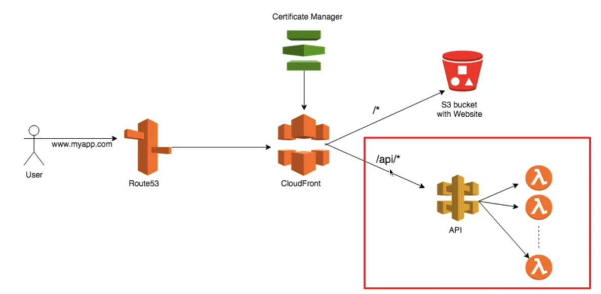

# Getting Started with Create React App

### Steps
1. Generate a ReactApp using npx create-react-app {app_name}
2. Run the app using `npm run start`
3. Build the app using `npm run build`
4. Download AWSCLI for your machine
5. Setup credentials using `aws configure`
6. Add below scripts
~~~json
{
    "deploy-s3": "aws s3 --profile <profile-name> sync ./build/ s3://<bucket-name> --region us-east-1",
    "cache-bust": "aws --profile <profile-name> cloudfront create-invalidation --distribution-id <distribution-id> --paths \"/*\"",
}
~~~
7. Create an Invalidation in Cloudfront distribution
8. Make sure to add your `<profile-name>`, `<distribution-id>` and `<bucket-name>`

9. Download serverless using `npm install -g serverless` command
10. Create a serverless application using `serverless create --template aws-nodejs --path <project-name>`
11. To deploy an app use `serverless deploy` and you will be given a console out of the newly created api endpoint
12. You can check in `API Gateway` for the created APIs
13. Use `serverless remove` to remove all the infrastructure created in AWS
14. Create a new origin in CloudFront for API Gateway
    - eg: `<domain-of-api-gateway>`
15. Create a behaviour to send all the requests to API Gateway if it matches the path pattern
    - eg: `<domain-of-cloudfront>/users/hello` will call the backend API we created using serverless framework

